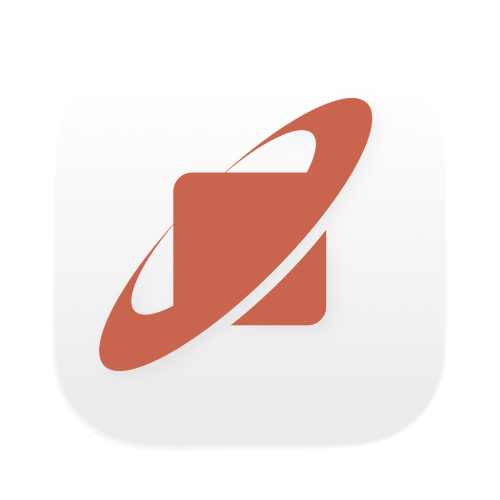

<p align="center">
  
</p>

<h1 align="center">Orbit CLI</h1>

<p align="center">
  <strong>The terminal agent for Orbit.</strong><br/>
  AI-powered coding agent that runs locally in your terminal. Built on the Ratatui TUI framework with a pluggable backend architecture.
</p>

<p align="center">
  <a href="https://github.com/Recusive/Orbit-CLI"></a>
  
  
  
  
</p>

---

## About

Orbit CLI is the terminal-based coding agent for the [Orbit](https://github.com/Recusive/Orbit) ecosystem — built by [Recursive Labs](https://orbit.build).

Orbit is an AI-native development environment where one AI agent works across every surface you build with. Orbit CLI brings that same agent to your terminal for developers who live in the command line.

**Orbit Desktop** gives you the full GUI — editor, browser, terminal, vault — all with an embedded AI agent that sees everything.
**Orbit CLI** gives you the same agent capabilities in a rich terminal UI, no IDE required.

Both share the same core engine. One agent, two interfaces, zero context switching.

---

## What is Orbit CLI

Orbit CLI is a local coding agent that runs in your terminal. It can:

- **Write and edit code** — understands your codebase, makes targeted changes
- **Execute commands** — runs shell commands in a sandboxed environment
- **Search and navigate** — finds files, functions, and patterns across your project
- **Manage git** — staging, commits, diffs, branches
- **Use tools** — extensible tool system for file ops, patches, and more
- **Run as a server** — JSON-RPC WebSocket API for IDE integrations
- **Expose MCP** — Model Context Protocol server for tool sharing

---

## Features

- **Rich Terminal UI** — Built with Ratatui for a polished, responsive terminal experience
- **AI Agent Integration** — Conversational coding agent with tool execution
- **Sandboxed Execution** — Commands run in platform-specific sandboxes (Seatbelt on macOS, Landlock/seccomp on Linux)
- **MCP Support** — Model Context Protocol server for IDE integrations
- **App Server** — JSON-RPC WebSocket server for programmatic access
- **Skills System** — Extensible skill framework for custom agent behaviors
- **Session Management** — Persistent sessions with conversation history
- **File Operations** — Read, write, search, and patch files
- **Git Integration** — Built-in git operations and diff handling
- **Hooks System** — Lifecycle hooks for customizing agent behavior
- **Multi-Agent** — Spawn and manage multiple agent instances
- **Python & TypeScript SDKs** — Programmatic access from your language of choice

---

## Architecture

```
┌─────────────────────────────────────────────────────┐
│                    Orbit CLI                         │
├─────────────────────────────────────────────────────┤
│                                                     │
│  codex-rs/tui        Terminal UI (Ratatui)          │
│  codex-rs/core       Agent engine & tool execution  │
│  codex-rs/protocol   Message types & prompts        │
│  codex-rs/cli        Binary entry point & dispatch  │
│                                                     │
│  codex-rs/app-server      JSON-RPC WebSocket API    │
│  codex-rs/mcp-server      MCP protocol server       │
│  codex-rs/exec-server     Headless execution server │
│                                                     │
│  codex-rs/exec            Sandboxed execution       │
│  codex-rs/linux-sandbox   Linux sandbox (Landlock)  │
│  codex-rs/windows-sandbox Windows sandbox            │
│                                                     │
│  sdk/python          Python SDK                     │
│  sdk/typescript      TypeScript SDK                 │
│  shell-tool-mcp/     Shell tool MCP server          │
│                                                     │
└─────────────────────────────────────────────────────┘
```

---

## Development

### Prerequisites

- Rust 1.85+
- Node.js 22+
- pnpm 10+
- `just` command runner
- `cargo-nextest` (recommended for faster tests)

### Quick Start

```bash
# Clone
git clone https://github.com/Recusive/Orbit-CLI.git
cd Orbit-CLI

# Install Rust dependencies
cd codex-rs && cargo fetch

# Run from source
just codex

# Run tests
just test

# Format code
just fmt

# Lint
just fix
```

### Key Commands

| Command | Description |
|---------|-------------|
| `just codex` | Run Orbit CLI from source |
| `just test` | Run all Rust tests |
| `just fmt` | Format Rust code |
| `just fix` | Run clippy fixes |
| `just codex exec` | Run in headless/exec mode |
| `just mcp-server-run` | Run the MCP server |
| `just write-config-schema` | Regenerate config JSON schema |

---

## Repository Structure

```
Orbit-CLI/
├── codex-rs/              # Primary Rust codebase
│   ├── cli/               # Main binary entry point
│   ├── core/              # Agent engine, tools, config
│   ├── tui/               # Terminal UI (Ratatui)
│   ├── tui_app_server/    # TUI with app-server backend
│   ├── protocol/          # Message types and prompts
│   ├── app-server/        # JSON-RPC WebSocket API
│   ├── mcp-server/        # MCP protocol server
│   ├── exec/              # Headless execution
│   ├── exec-server/       # Execution server
│   ├── hooks/             # Lifecycle hook system
│   ├── skills/            # Skills framework
│   ├── state/             # SQLite session persistence
│   ├── config/            # TOML config system
│   ├── login/             # OAuth authentication
│   ├── utils/             # 19 utility crates
│   └── ...                # 50+ total crates
├── sdk/                   # Client SDKs
│   ├── python/            # Python SDK
│   └── typescript/        # TypeScript SDK
├── shell-tool-mcp/        # Shell tool MCP server
├── codex-cli/             # npm package wrapper
├── docs/                  # Documentation
├── scripts/               # Build & install scripts
└── tools/                 # Developer tooling
```

---

## Ecosystem

| Project | Description |
|---------|-------------|
| [**Orbit**](https://github.com/Recusive/Orbit) | AI-native desktop IDE (Tauri + React) |
| **Orbit CLI** (this repo) | Terminal-based coding agent |

---

## Contributing

We welcome contributions! Please see [CONTRIBUTING.md](CONTRIBUTING.md) for guidelines.

---

## License

Copyright (c) 2025 Recursive Labs. All rights reserved.

This software is proprietary. See [LICENSE](LICENSE) for details.

---

<p align="center">Built by <a href="https://orbit.build">Recursive Labs</a></p>
